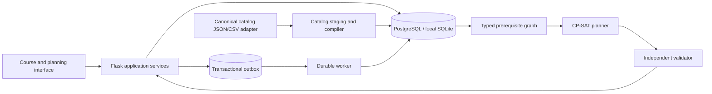
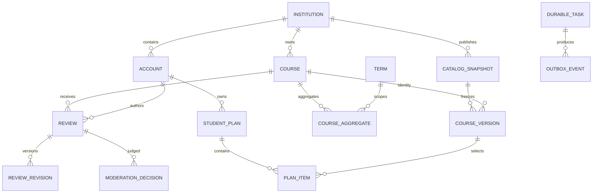
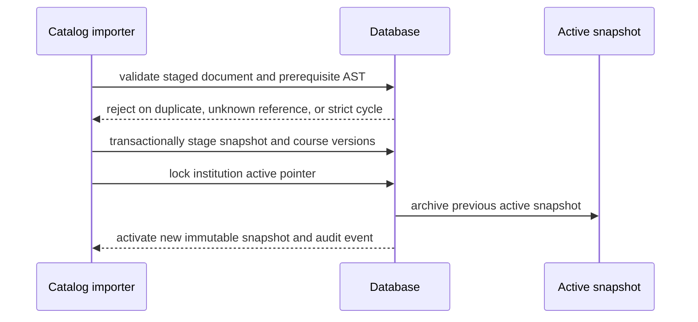
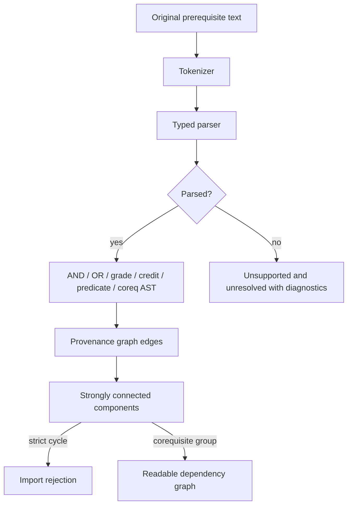
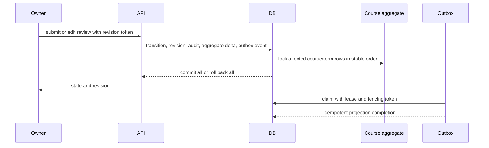
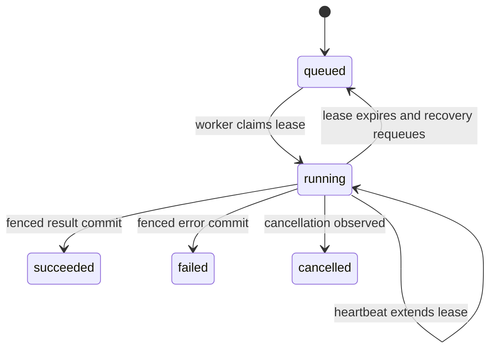
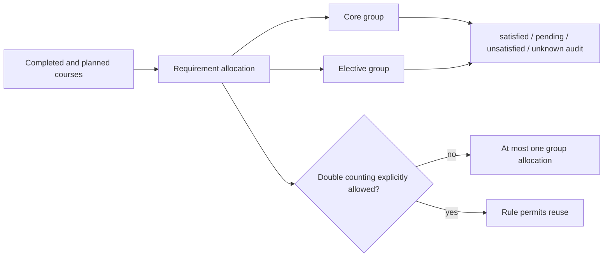
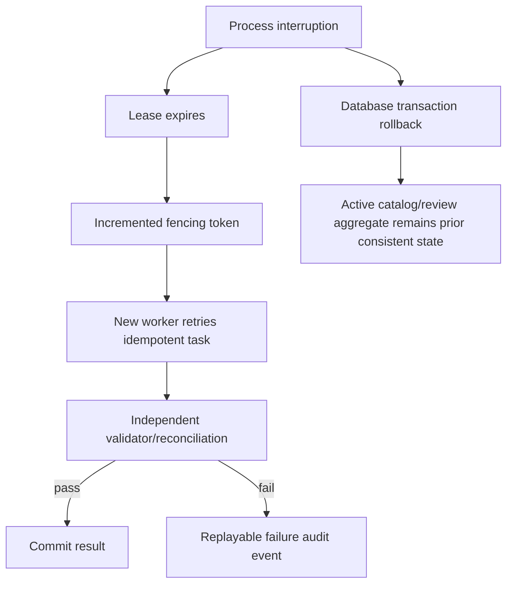

# System and data architecture

Boiler Reviews is a modular monolith with one durable worker. Flask translates HTTP into typed application-service calls. Domain modules do not import Flask or construct ORM queries: catalog compilation, prerequisite evaluation, degree allocation, planning, section scheduling, validation, and task leasing remain executable as ordinary Python contracts. SQLAlchemy owns persistence and ordered migrations; PostgreSQL is the production concurrency contract and SQLite is an isolated development/test option.

The stable `courses` row is the review-history identity. `course_versions` is a snapshot-specific presentation and prerequisite contract. Plans keep both the catalog snapshot and degree-rule version that produced them, so a later catalog cannot silently rewrite a historical plan. Review aggregates contain counts and sufficient sums by course/term; the authoritative published revision pointer is the reconciliation input.

These diagrams describe the modules in `src/boiler_reviews`, not a proposed future service mesh. A separate process exists only for long-running tasks and projection isolation.
